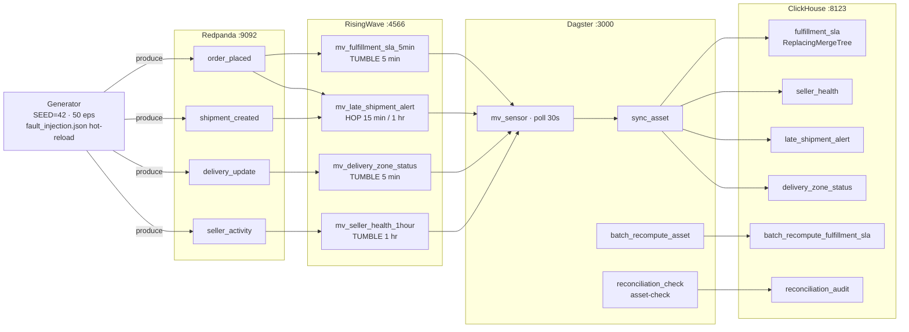

# marketplace-streaming

Real-time marketplace analytics: Redpanda → RisingWave streaming SQL → ClickHouse, with Dagster batch-vs-stream reconciliation and live fault injection.

---

## The problem

Marketplace fulfillment fails silently. An order placed at midnight might sit unshipped for two hours before any system notices the SLA is at risk. A carrier zone goes dark, deliveries queue up, and the first signal is a customer complaint the next morning. Streaming analytics addresses this — but only if the stream is correct. A windowed aggregate with a misconfigured watermark emits a plausible-looking number with no indication that 7% of late-arriving events were silently dropped. The interesting engineering problem is not producing metrics fast: it is **knowing whether the fast metrics are right**. This project wires up a streaming pipeline with fault injection and an independent batch recompute layer that fails loudly when the two disagree, making correctness visible rather than assumed.

---

## Architecture



---

## Key features

- **Four streaming SQL materialized views** — TUMBLE and HOP windows over four Kafka topics, defined in plain ANSI SQL readable with any Postgres client.
- **Live fault injection without container restarts** — a hot-reloaded JSON control file switches between baseline, late-arrival (10% rate), duplicate, null-field, and zone-blackout modes while the stack is running.
- **Independent batch-vs-stream reconciliation** — Dagster recomputes the fulfillment-SLA metric from raw events via pandas and diffs it against the streaming output per 5-minute window. Divergence triggers an `ERROR`-severity asset-check failure.
- **Deterministic replay** — `SEED=42` produces a bit-for-bit identical event stream, making reconciliation results reproducible across machines and CI runs.
- **Explicit watermark tradeoff** — standard mode (`sql/01_sources.sql`, 5-minute watermark) vs fault mode (`sql/01_sources_fault_mode.sql`, 6-hour watermark) are two independently reviewable SQL files. The difference is diffable; no templating or sed-in-place mutation.
- **Two-lane CI** — fast lane (116 tests, ~1.4s, no containers) covers all generator and reconciliation logic. Integration lane (14 tests, ~175s) boots the full docker-compose topology and verifies the streaming path end-to-end.

---

## Demo

The full fault-injection scenario runs in one command once the stack is up:

```bash
make demo
```

The 8-step scenario:

| Step | What happens |
|------|-------------|
| 1 | Stack health check — RisingWave :4566 and ClickHouse :8123 |
| 2 | Baseline stats — streaming rows, batch rows, reconciliation verdict breakdown |
| 3 | Enable `late_arrival` fault injection at 10% rate — generator hot-reloads within 5 seconds |
| 4 | Wait 30 real-seconds (= ~30 simulated hours at 3600x acceleration) for MVs to absorb late arrivals |
| 5 | Post-fault stats — diverged windows appear as batch sees late events sooner than the stream |
| 6 | Disable fault injection — generator returns to baseline within 5 seconds |
| 7 | Wait 30 real-seconds for the watermark to advance and late events to land in the correct windows |
| 8 | Final reconciliation summary — all windows should show `converged`, zero `diverged` |

Preview the scenario without a live stack:

```bash
python scripts/demo.py --dry-run
```

---

## Results

| Metric | Value | Notes |
|--------|-------|-------|
| Throughput | 50 events/sec | Configured via `EVENTS_PER_SECOND=50`; adjustable |
| End-to-end latency (stream) | <2s | Event produced → MV row visible in RisingWave `psql` |
| ClickHouse sync latency | ~30s | Dagster sensor poll interval |
| MV correctness | 0 diverged windows | Across 140 windows at `N_EVENTS=300`, `SEED=42` |
| Fault recovery | ~30s wall-clock | Watermark advances past late events at 3600x acceleration |
| Fast CI | 116 tests, 0 failures | ~1.4s, no containers |
| Integration CI | 14 tests, 0 failures | ~175s, full docker-compose topology |

Reconciliation scenarios (reproducible at `SEED=42`):

| Scenario | Outcome |
|----------|---------|
| Clean — streaming matches batch on every window | asset-check PASSES |
| Diverged — late arrivals cause streaming undercount | asset-check FAILS, `ERROR` severity |
| Converged — watermark advances, late events land | status flips to `converged` |

---

## Tech stack

| Tool | Role | Why this tool |
|------|------|---------------|
| [Redpanda](https://redpanda.com) | Kafka-compatible message broker | Kafka wire protocol, single binary, no ZooKeeper — drops into docker-compose without a cluster |
| [RisingWave](https://risingwave.com) | Streaming SQL engine | PostgreSQL wire protocol, `CREATE MATERIALIZED VIEW` as the programming model — windowing logic is plain SQL, reviewable with psql |
| [ClickHouse](https://clickhouse.com) | Analytical sink | `ReplacingMergeTree` absorbs at-least-once delivery without dedup logic in the writer; columnar storage is right for windowed aggregates |
| [Dagster](https://dagster.io) | Orchestration and reconciliation | Asset-check primitive maps cleanly to the pass/fail reconciliation guard; in-process executor keeps integration tests daemon-free |
| Python / pandas | Generator and batch recompute | Generator determinism via `numpy.random.default_rng(seed)`; pandas is sufficient for the batch aggregation and avoids a second query engine |

---

## Quickstart

**Prerequisites:** Docker Desktop with at least 4 GB RAM allocated, `docker compose` v2.x, Python 3.12+ and [uv](https://docs.astral.sh/uv/).

```bash
git clone https://github.com/OmerTDK/marketplace-streaming.git
cd marketplace-streaming
docker compose up --build
```

Services take ~30 seconds to become healthy.

```bash
# Inspect a live materialized view
psql -h localhost -p 4566 -U root -c "SELECT * FROM mv_fulfillment_sla_5min LIMIT 10;"

# Query the ClickHouse sink (FINAL required — ReplacingMergeTree dedup is lazy)
curl "http://localhost:8123/?query=SELECT+*+FROM+fulfillment_sla+FINAL+LIMIT+10"

# Open the Dagster UI
open http://localhost:3000

# Run the E2E fault-injection demo
make demo
```

### Fast CI (no containers)

```bash
uv sync
uv pip install -e .
make ci         # ruff + sqlfluff + pytest, 116 tests, ~1.4s
```

### Integration tests (requires Docker)

```bash
make integration    # boots full compose topology, ~175s
```

---

## Design decisions

| ADR | Decision | Hardest part |
|-----|----------|-------------|
| [ADR-0001](docs/adr/0001-streaming-engine.md) | RisingWave v1.8.2 over Flink | Accepted at-least-once delivery to ClickHouse (absorbed by `ReplacingMergeTree`) in exchange for a single binary, psql-compatible interface, and no JVM |
| [ADR-0002](docs/adr/0002-architecture.md) | Full topology: docker-compose, event domain model, watermark decision | Choosing `scanned_at` (carrier event-time) as the watermark column, not `produced_at` (ingest time) — and accepting that a 5-minute watermark drops ~7% of late delivery events by design |
| [ADR-0003](docs/adr/0003-generator-design.md) | Deterministic generator with injectable sink | Deriving UUIDs from the seeded RNG (two `uint64` values → 128-bit → RFC 4122) so the event stream is bit-for-bit reproducible, not just statistically consistent |
| [ADR-0004](docs/adr/0004-ci-strategy.md) | Two-lane CI: fast container-free default + gated integration | Using the repo's own `docker-compose.yml` as the test substrate (via testcontainers `DockerCompose`) so SQL artifacts are applied unchanged — no broker-address substitution |
| [ADR-0005](docs/adr/0005-reconciliation.md) | Batch-vs-stream reconciliation with Dagster asset-check kill-switch | Replicating the MV's LEFT JOIN fan-out in the batch path — an order with two delivered-final events fans out to two rows in both paths, which a naive per-order dedup would miss |
| [ADR-0006](docs/adr/0006-demo-and-results.md) | Dual-mode demo (`--dry-run` / live) and measurement methodology | Deciding that `--dry-run` (narrative output, hardcoded representative values) is the right CI assertion for a demo script that orchestrates four stateful services |

### The hardest decision: watermark vs late-event correctness

The core streaming semantics tradeoff in this project is the watermark interval on `delivery_update_source`. A streaming engine must commit to a cutoff: events arriving before the watermark close into a window; events arriving after are either dropped (standard mode) or held open in a wider buffer (fault mode).

A 5-minute watermark (`sql/01_sources.sql`) closes windows quickly — results appear in ClickHouse within ~30 seconds of the window boundary. But the generator's ~7% late-delivery rate means a real fraction of events arrive after the watermark and are excluded. The batch recompute (reading the full raw event log) sees these events. This is the divergence the reconciliation guard is designed to catch and surface.

The fault-mode watermark (`sql/01_sources_fault_mode.sql`, 6 hours) absorbs nearly all late arrivals at the cost of holding 6 hours of window state in memory. The two files are the authoritative, independently diffable record of each mode — no templating, no sed-in-place mutations.

---

## License

Apache-2.0. See [LICENSE](LICENSE).
