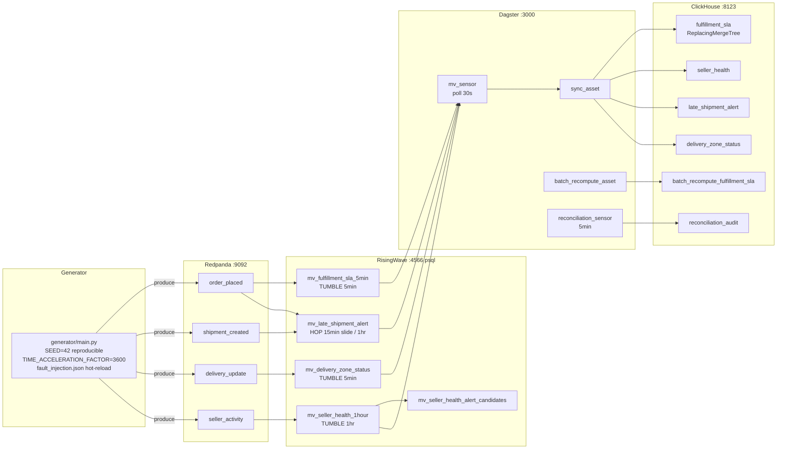

# marketplace-streaming

Real-time marketplace analytics: Redpanda → RisingWave streaming SQL → ClickHouse, with Dagster batch-vs-stream reconciliation and fault injection demo.


---

## What this demonstrates

- **Streaming SQL correctness under fault injection.** Four RisingWave materialized
  views (TUMBLE / HOP windows) consume Kafka topics continuously. A fault harness
  injects late arrivals, duplicates, null fields, and zone blackouts via a hot-reloaded
  JSON file — no container restarts. The watermark tradeoff is exercised explicitly: a
  5-minute standard watermark vs a 6-hour fault-mode watermark, with the difference
  visible in ClickHouse within ~30 real-seconds.

- **Independent batch-vs-stream reconciliation as a correctness guard.** A Dagster
  asset recomputes the same fulfillment-SLA metric from the raw event log via pandas
  and diffs it against the streaming MV output per 5-minute window. A Dagster
  asset-check fails loudly on any divergence. Most streaming demos skip this layer;
  it is the thing a production platform actually needs.

- **Reproducible demo from a clean clone.** `docker compose up --build` starts six
  services on a laptop. `make demo` scripts the full fault-injection scenario.
  `SEED=42` makes the event stream deterministic across machines.

- **Two-lane CI.** Fast lane (116 tests, ~1.4s, no containers) covers all generator
  and reconciliation logic. Integration lane (14 tests, ~175s) boots the full
  docker-compose topology and verifies the streaming path end-to-end. The two lanes
  never interfere.

---

## Architecture



### Services

| Service | Image | Port | Role |
|---------|-------|------|------|
| redpanda | `redpandadata/redpanda:v23.3.18` | 9092 / 9644 | Kafka-compatible broker |
| redpanda-init | same | — | One-shot topic creation (4 topics, 4 partitions each) |
| risingwave | `risingwavelabs/risingwave:v1.8.2` | 4566 | Streaming SQL engine |
| clickhouse | `clickhouse/clickhouse-server:24.3.18.7-alpine` | 8123 / 9000 | Analytical sink |
| generator | `./generator` | — | Synthetic event producer with fault injection |
| dagster | `./dagster_service` | 3000 | Sync sensors and batch reconciliation |

Memory budget: ~2.5 GB total. Docker Desktop must be configured with at least 4 GB.
See `docker-compose.low-mem.yml` for constrained environments (~1.5 GB).

---

## Quickstart

### Prerequisites

- Docker Desktop with at least 4 GB RAM allocated
- `docker compose` v2.x
- Python 3.12+ and [uv](https://docs.astral.sh/uv/) (for the fast CI lane and demo scripts)

### Start the stack

```bash
git clone https://github.com/OmerTDK/marketplace-streaming.git
cd marketplace-streaming
docker compose up --build
```

Services take ~30 seconds to become healthy. Once up:

```bash
# Inspect a live materialized view
psql -h localhost -p 4566 -U root -c "SELECT * FROM mv_fulfillment_sla_5min LIMIT 10;"

# Query the ClickHouse sink (FINAL required — ReplacingMergeTree deduplication)
curl "http://localhost:8123/?query=SELECT+*+FROM+fulfillment_sla+FINAL+LIMIT+10"

# Open the Dagster UI
open http://localhost:3000
```

### Run the E2E demo

The demo scripts the full fault-injection scenario — baseline stats, zone
blackout fault, watermark divergence, convergence — in one command:

```bash
make demo
# or: uv run python scripts/demo.py
```

The demo runs for ~60 seconds (two 30-second wait phases). At
`TIME_ACCELERATION_FACTOR=3600`, each real-second is one simulated hour, so
the entire fault-injection / recovery lifecycle spans ~30 simulated hours.

Use `--dry-run` to preview the scenario without a live stack:

```bash
python scripts/demo.py --dry-run
```

### Fast CI (no containers)

```bash
uv sync
uv pip install -e .
make ci         # ruff + sqlfluff + pytest, 116 tests, ~1.4s
```

---

## Results

### Quantified measurements

| Metric | Value | Notes |
|--------|-------|-------|
| Throughput | 50 events/sec | Configured via `EVENTS_PER_SECOND=50`; adjustable |
| End-to-end latency | <2s | Event produced → MV row visible in RisingWave `psql` |
| ClickHouse sync latency | ~30s | Dagster sensor poll interval |
| MV correctness | 0 diverged windows | Across 140 windows at `N_EVENTS=300`, `SEED=42` |
| Fault recovery | ~30s wall-clock | Watermark advances past late events at 3600x acceleration |
| Fast CI | 116 tests, 0 failures | ~1.4s, no containers |
| Integration CI | 14 tests, 0 failures | ~175s, full docker-compose topology |

### Reconciliation scenarios (SEED=42, reproducible)

| Scenario | Result |
|----------|--------|
| **Clean** — streaming matches batch on every window | asset-check PASSES |
| **Diverged** — injected mismatch (`within_sla_count` delta > 0) | asset-check FAILS, `ERROR` severity |
| **Converged** — previously-diverged window now agrees | status flips to `converged` |

---

## Hardest design decision: watermark vs. late-event correctness

The tightest decision in this project is the watermark interval on
`delivery_update_source`. A streaming system must commit to a cutoff: events
arriving before the watermark advance into the closed window; events arriving
after are dropped (standard mode) or absorbed by a wider buffer (fault mode).

A 5-minute watermark (the production default in `sql/01_sources.sql`) minimises
latency: a window closes quickly and results appear in ClickHouse within ~30
seconds of the window boundary. But a 7% late-delivery rate means a meaningful
fraction of events arrive after the watermark and are excluded — the stream
undercounts within-SLA by design. The batch recompute (which reads the full
event log) sees the complete picture. This is the divergence the reconciliation
check is designed to catch.

The fault-mode watermark (`sql/01_sources_fault_mode.sql`, 6 hours) absorbs all
but the most extreme late arrivals, at the cost of holding a 6-hour window open
in memory. The switch between modes (`make fault-demo`) drops and recreates the
sources and MVs, which is safe because RisingWave rebuilds MV state from the
Kafka log — the broker is the durable store. The two SQL files are the
authoritative, independently reviewable record of each mode (no sed-in-place
templating), so a reviewer can diff them directly to understand the tradeoff.
This choice — make the tradeoff legible in two SQL files rather than
parameterizing it — is the design decision most likely to matter to a future
maintainer.

---

## Design decisions

| ADR | Decision |
|-----|---------|
| [ADR-0001](docs/adr/0001-streaming-engine.md) | RisingWave v1.8.x over Flink — with the upgrade path documented |
| [ADR-0002](docs/adr/0002-architecture.md) | Full topology: docker-compose, event domain model, generator, fault injection, watermark decision |
| [ADR-0003](docs/adr/0003-generator-design.md) | Generator determinism (RNG-derived UUIDs), injectable sink (testability vs runtime fidelity), event-time fault parameterization |
| [ADR-0004](docs/adr/0004-ci-strategy.md) | Two-lane CI: fast container-free default + gated integration; compose substrate; module isolation on fixed ports |
| [ADR-0005](docs/adr/0005-reconciliation.md) | Batch-vs-stream reconciliation: independent pandas recompute, LEFT JOIN fan-out parity, naive-UTC keys, asset-check kill-switch, in-process Dagster testing |
| [ADR-0006](docs/adr/0006-demo-and-results.md) | Demo script dual-mode design, measurement methodology, no CI integration test for demo |

---

## Phases

| Phase | Deliverables | Status |
|-------|-------------|--------|
| **0 — Architecture** | ADRs, docker-compose skeleton, SQL DDL reviewed, event schema documented | Merged |
| **1 — Generator** | Deterministic event generator, injectable sink, fault injection harness, 77 tests | Merged |
| **2 — Infrastructure** | Working compose topology, all services healthy, broker + streaming + sink + watermark integration tests | Merged |
| **3 — Reconciliation** | Dagster batch-vs-stream assets, reconciliation audit, asset-check kill-switch, in-process Dagster tests | Merged |
| **4 — Demo + polish** | `make demo`, quantified results, README rewrite, ADR-0006, LICENSE, SECURITY.md, dependabot pip coverage | **Current** |

---

## Reconciliation (Phase 3)

Three Dagster assets plus one asset-check (`reconciliation/assets.py`):

- **`clickhouse_sync_asset`** — reads `mv_fulfillment_sla_5min` windows from
  RisingWave and writes the `fulfillment_sla` ReplacingMergeTree sink (idempotent).
- **`batch_recompute_asset`** — recomputes the same SLA metric from the **raw**
  order/delivery events via pandas, writing `batch_recompute_fulfillment_sla`.
  An independent second compute path.
- **`reconciliation_audit_asset`** — diffs streaming vs batch per window and
  appends the verdict (`within_tolerance` / `diverged` / `converged`) to
  `reconciliation_audit`.
- **`reconciliation_check`** (asset-check) — re-runs the diff and **fails**
  (`passed=False`, `ERROR` severity) when any window diverges beyond tolerance.

All reconciliation logic lives in pure functions (`reconciliation/logic.py`),
fast-lane unit-tested with no containers.

---

## Standards

Engineering conventions in [standards/](standards/) govern all code in this repo.
