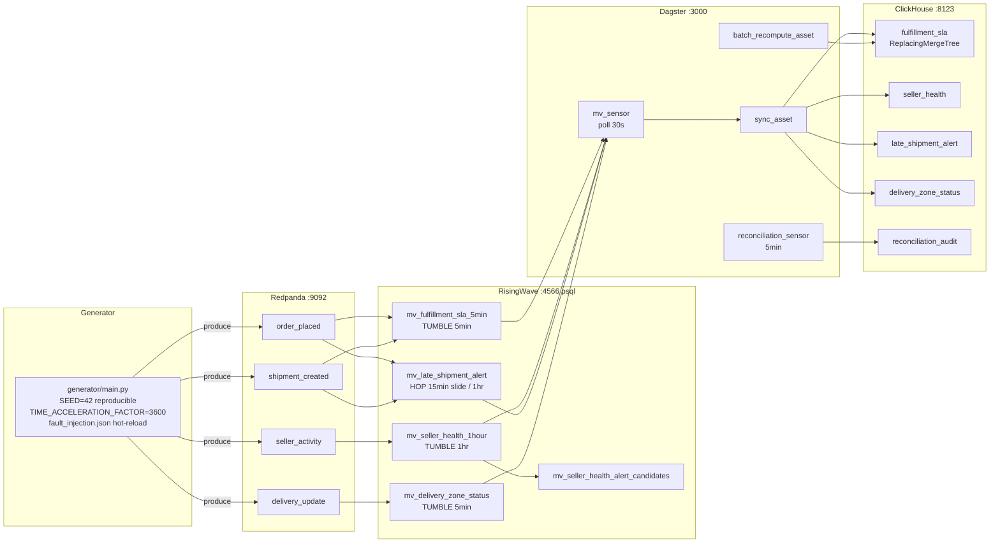

# marketplace-streaming

Real-time marketplace analytics: Redpanda → RisingWave streaming SQL → ClickHouse, with Dagster batch reconciliation and fault injection demo.

> Status: Phase 0 — architecture designed, implementation begins in Phase 1.

---

## Why this exists

Marketplace platforms produce high-frequency, multi-topic event streams:
orders placed, shipments created, delivery status updates, seller activity.
The analytical questions — "what is our SLA compliance rate over the last
5 minutes?" or "which delivery zones are failing today?" — require sub-minute
freshness that a nightly batch cannot provide.

This project demonstrates a production-grade streaming analytics stack using
open-source tools that fit in a laptop:

- **Redpanda** as the Kafka-compatible event broker (single binary, no ZooKeeper)
- **RisingWave** as the streaming SQL engine (`CREATE MATERIALIZED VIEW` over Kafka topics)
- **ClickHouse** as the analytical sink (`ReplacingMergeTree` for idempotent writes)
- **Dagster** for orchestration: RisingWave-to-ClickHouse sync sensors and batch-vs-stream reconciliation
- A **Python event generator** with configurable fault injection (late arrivals, duplicates, null fields, zone blackouts)

The portfolio signal is the streaming semantics:
watermark declarations, windowing correctness under fault injection, and the
explicit trade-off between latency and late-event correctness.

---

## Architecture



### Services

| Service | Image | Port | Role |
|---------|-------|------|------|
| redpanda | `redpandadata/redpanda:v23.3.x` | 9092 / 9644 | Kafka-compatible broker |
| redpanda-init | same | — | One-shot topic creation (4 topics, 4 partitions each) |
| risingwave | `risingwavelabs/risingwave:v1.8.x` | 4566 | Streaming SQL engine |
| clickhouse | `clickhouse/clickhouse-server:24.3-alpine` | 8123 / 9000 | Analytical sink |
| generator | `./generator` | — | Synthetic event producer with fault injection |
| dagster | `./dagster` | 3000 | Sync sensors and batch reconciliation |

Memory budget: ~2.5 GB total. Docker Desktop must be configured with at least 4 GB.
See `docker-compose.low-mem.yml` for constrained environments (~1.5 GB).

---

## Planned phases

| Phase | Deliverables |
|-------|-------------|
| **0 — Architecture** (current) | ADRs, docker-compose skeleton, SQL DDL reviewed, event schema documented |
| **1 — Infrastructure** | Working `docker compose up --build`, all services healthy |
| **2 — Generator** | Python generator producing synthetic events, fault injection working |
| **3 — Streaming SQL** | RisingWave sources and MVs live, queryable via psql |
| **4 — ClickHouse sink** | Dagster sync assets writing to ClickHouse, FINAL queries verified |
| **5 — Reconciliation** | Batch recompute asset + reconciliation sensor, divergence/convergence demo |
| **6 — Demo + polish** | `make fault-demo` script, kill-verification integration test, README with real numbers |

---

## Quickstart (Phase 1+)

### Prerequisites

- Docker Desktop with at least 4 GB RAM allocated
- `docker compose` v2.x

```bash
git clone https://github.com/OmerTDK/marketplace-streaming.git
cd marketplace-streaming
docker compose up --build
```

Services take ~30 seconds to become healthy. Then:

```bash
# Inspect a live materialized view
psql -h localhost -p 4566 -U root -c "SELECT * FROM mv_fulfillment_sla_5min LIMIT 10;"

# Query the ClickHouse sink (FINAL required — see clickhouse/init.sql)
curl "http://localhost:8123/?query=SELECT+*+FROM+fulfillment_sla+FINAL+LIMIT+10"

# Open the Dagster UI
open http://localhost:3000

# Run the fault injection demo
make fault-demo
```

---

## Design decisions

| ADR | Decision |
|-----|---------|
| [ADR-0001](docs/adr/0001-streaming-engine.md) | RisingWave v1.8.x over Flink — with the upgrade path documented |
| [ADR-0002](docs/adr/0002-architecture.md) | Full topology: docker-compose, event domain model, generator, fault injection, watermark decision |

---

## Results

Phase 0 — no runtime numbers yet. Results will be added in Phase 6 with real
measurements: event throughput, end-to-end latency at clean-stream and fault
modes, ClickHouse query times, reconciliation convergence time.

---

## Standards

Engineering conventions in [standards/](standards/) govern all code in this repo.
