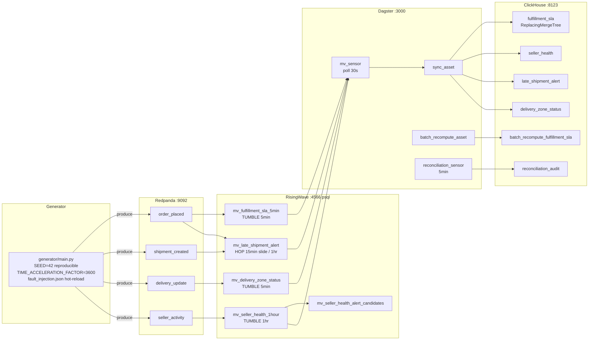

# marketplace-streaming

Real-time marketplace analytics: Redpanda → RisingWave streaming SQL → ClickHouse, with Dagster batch reconciliation and fault injection demo.

> Status: Phase 3 — the Dagster batch-vs-stream reconciliation is live. An
> independent pandas recompute of the fulfillment-SLA metric is diffed against
> the streaming MV, and a Dagster asset-check fails loudly on divergence. The
> integration suite boots the docker-compose stack (Redpanda + RisingWave +
> ClickHouse) and verifies the streaming path, the watermark kill-test, and the
> reconciliation kill-verify (check passes clean, fails on injected divergence).

---

## Why this exists

Marketplace platforms produce high-frequency, multi-topic event streams:
orders placed, shipments created, delivery status updates, seller activity.
The analytical questions — "what is our SLA compliance rate over the last
5 minutes?" or "which delivery zones are failing today?" — require sub-minute
freshness that a nightly batch cannot provide.

This project demonstrates a production-grade streaming analytics stack using
open-source tools that fit in a laptop:

- **Redpanda** as the Kafka-compatible event broker (single binary, no ZooKeeper)
- **RisingWave** as the streaming SQL engine (`CREATE MATERIALIZED VIEW` over Kafka topics)
- **ClickHouse** as the analytical sink (`ReplacingMergeTree` for idempotent writes)
- **Dagster** for orchestration: RisingWave-to-ClickHouse sync sensors and batch-vs-stream reconciliation
- A **Python event generator** with configurable fault injection (late arrivals, duplicates, null fields, zone blackouts)

The portfolio signal is the streaming semantics:
watermark declarations, windowing correctness under fault injection, and the
explicit trade-off between latency and late-event correctness.

---

## Architecture



### Services

| Service | Image | Port | Role |
|---------|-------|------|------|
| redpanda | `redpandadata/redpanda:v23.3.18` | 9092 / 9644 | Kafka-compatible broker |
| redpanda-init | same | — | One-shot topic creation (4 topics, 4 partitions each) |
| risingwave | `risingwavelabs/risingwave:v1.8.2` | 4566 | Streaming SQL engine |
| clickhouse | `clickhouse/clickhouse-server:24.3.18.7-alpine` | 8123 / 9000 | Analytical sink |
| generator | `./generator` | — | Synthetic event producer with fault injection |
| dagster | `./dagster` | 3000 | Sync sensors and batch reconciliation |

Memory budget: ~2.5 GB total. Docker Desktop must be configured with at least 4 GB.
See `docker-compose.low-mem.yml` for constrained environments (~1.5 GB).

---

## Planned phases

| Phase | Deliverables | Status |
|-------|-------------|--------|
| **0 — Architecture** | ADRs, docker-compose skeleton, SQL DDL reviewed, event schema documented | Merged |
| **1 — Generator** | Deterministic event generator, injectable sink, fault injection harness, sqlfluff wired | Merged |
| **2 — Infrastructure** | Working compose topology, all services healthy, broker + streaming + sink + watermark integration tests on the compose substrate | Merged |
| **3 — Reconciliation** | Dagster `clickhouse_sync` + `batch_recompute` assets, `reconciliation_audit` asset, asset-check that fails on divergence; clean/diverged/converged scenarios; in-process Dagster test | Current |
| **4 — Streaming SQL** | RisingWave sources and MVs live, queryable via psql | Covered by Phase 2 integration suite |
| **5 — ClickHouse sink** | Dagster sync assets writing to ClickHouse, FINAL queries verified | Verified (Phase 2 sync + Phase 3 asset) |
| **6 — Demo + polish** | `make fault-demo` script, kill-verification integration test, README with real numbers | In progress |

> **Phase numbering note.** This table reflects the as-built ordering (the
> reconciliation layer was pulled forward ahead of the streaming-SQL/sink
> hardening). The original plan in `docs/brief.md` and the older ADRs
> (notably ADR-0002) use the pre-renumbering order — Streaming SQL = Phase 3,
> ClickHouse sink = Phase 4, Reconciliation = Phase 5. Their technical content
> is unchanged; only the phase labels differ from this table.

---

## Generator (Phase 1)

The generator is fully unit-testable without any containers. All business
logic is separated from the transport layer via the `Sink` interface.

### Seed determinism

```bash
# Install (Python 3.12+, uv required)
uv sync
uv pip install -e .

# Run the test suite (no containers, no broker)
make ci                      # ruff + sqlfluff + pytest, 74 tests, ~1s

# Generate 1000 events to an in-memory sink (Python REPL)
python -c "
from generator import run_generator
sink = run_generator(n_events=1000, seed=42)
print(sink.total_count(), 'events across', list(sink.all_records().keys()))
"
```

Within a given Python environment and dependency lockfile (`uv sync --frozen`),
the same `SEED` value produces an identical byte-for-byte event stream.
`TestDeterminism::test_full_stream_hash_is_stable` pins the expected SHA-256
hash of the full stream as a named constant — any cross-session regression
(Faker version bump, numpy RNG change, new field) causes a clear test failure
with the old and new hashes printed.

### Fault injection demo (Phase 2+)

The fault harness is already implemented. Once real infrastructure is up
(`make up`), enable faults by editing `shared/fault_injection.json`:

```json
{
  "active": true,
  "late_arrival_rate": 0.10,
  "zone_blackout_prefix": "5",
  "zone_blackout_duration_event_seconds": 7200
}
```

The generator hot-reloads this file every 5 seconds (no container restarts).
All durations are in event-time seconds, so at `TIME_ACCELERATION_FACTOR=3600`
a 7200-second zone blackout lasts 2 real-seconds — visible in the Dagster UI.

---

## Quickstart (Phase 2+, requires Docker)

### Prerequisites

- Docker Desktop with at least 4 GB RAM allocated
- `docker compose` v2.x

```bash
git clone https://github.com/OmerTDK/marketplace-streaming.git
cd marketplace-streaming
docker compose up --build
```

Services take ~30 seconds to become healthy. Then:

```bash
# Inspect a live materialized view
psql -h localhost -p 4566 -U root -c "SELECT * FROM mv_fulfillment_sla_5min LIMIT 10;"

# Query the ClickHouse sink (FINAL required — see clickhouse/init.sql)
curl "http://localhost:8123/?query=SELECT+*+FROM+fulfillment_sla+FINAL+LIMIT+10"

# Open the Dagster UI
open http://localhost:3000

# Run the fault injection demo
make fault-demo
```

---

## Design decisions

| ADR | Decision |
|-----|---------|
| [ADR-0001](docs/adr/0001-streaming-engine.md) | RisingWave v1.8.x over Flink — with the upgrade path documented |
| [ADR-0002](docs/adr/0002-architecture.md) | Full topology: docker-compose, event domain model, generator, fault injection, watermark decision |
| [ADR-0003](docs/adr/0003-generator-design.md) | Generator determinism (RNG-derived UUIDs), injectable sink (testability vs runtime fidelity), event-time fault parameterization |
| [ADR-0004](docs/adr/0004-ci-strategy.md) | Two-lane CI: fast container-free default + gated integration; compose substrate; module isolation on fixed ports |
| [ADR-0005](docs/adr/0005-reconciliation.md) | Batch-vs-stream reconciliation: independent pandas recompute, LEFT JOIN fan-out parity, naive-UTC keys, asset-check kill-switch, in-process Dagster testing |

---

## Reconciliation (Phase 3)

The batch-vs-stream reconciliation is the headline differentiator. Three Dagster
assets plus one asset-check (`reconciliation/assets.py`):

- **`clickhouse_sync_asset`** — reads `mv_fulfillment_sla_5min` windows from
  RisingWave and writes the `fulfillment_sla` ReplacingMergeTree sink (idempotent).
- **`batch_recompute_asset`** — recomputes the same SLA metric from the **raw**
  order/delivery events (the RisingWave source) via pandas, writing
  `batch_recompute_fulfillment_sla`. An independent second compute path.
- **`reconciliation_audit_asset`** — diffs streaming vs batch per window and
  appends the verdict (`within_tolerance` / `diverged` / `converged`) to
  `reconciliation_audit`.
- **`reconciliation_check`** (asset-check) — re-runs the diff and **fails**
  (`passed=False`, `ERROR` severity) when any window diverges beyond tolerance.

All reconciliation logic lives in pure functions (`reconciliation/logic.py`),
fast-lane unit-tested with no containers. The batch path mirrors the MV's
`LEFT JOIN` fan-out exactly — an order with two delivered-final delivery events
is counted twice, matching the stream (a real `SEED=42` case the integration run
surfaced; documented in [ADR-0005](docs/adr/0005-reconciliation.md)).

The three reproducible scenarios (`SEED=42`): **clean** (streaming == batch, check
passes), **diverged** (injected mismatch, check fails — kill-verified both ways),
**converged** (a previously-diverged window now agrees).

Run the full reconciliation flow in Dagster:

```bash
docker compose up --build        # includes the dagster service on :3000
open http://localhost:3000       # materialize the assets, see the check verdict
```

## Results

**Fast lane (no containers):** 101 tests, 0 failures, ~2.3s. ruff + sqlfluff +
pytest all pass from `make ci`. The reconciliation logic (recompute math + diff)
adds 24 of those tests; the Dagster integration module is skipped here
(`pytest.importorskip("dagster")`) so the fast lane stays dagster- and
container-free.

**Integration (Docker):** 14 tests, 0 failures, ~175s end-to-end via
`make integration` (Phase 2's 9 + Phase 3's 5 reconciliation tests). The suite
uses the repo's own `docker-compose.yml` as the test substrate (testcontainers
`DockerCompose`), so it exercises the exact topology and SQL artifacts a user runs:

**Reconciliation (Phase 3 additions):**
- **Sync** — `mv_fulfillment_sla_5min` rows land in the `fulfillment_sla` sink.
- **Clean-run parity** — the pandas batch recompute matches the streaming MV's
  `within_sla_count` on every emitted window (140 windows at `N_EVENTS=300`).
- **In-process Dagster** — all 3 assets materialize via `dagster.materialize`
  against the live RisingWave + ClickHouse — no daemon (ADR-0005).
- **Kill-verify** — the `reconciliation_check` passes on a clean run and fails on
  an injected divergence; verified by direct invocation AND via `materialize`.

**Phase 2 streaming path:**

- **Broker byte-parity** — `KafkaSink` → Redpanda → consumer round-trip matches
  the `InMemorySink` reference event-for-event (SEED=42).
- **Streaming SQL** — `sql/01_sources.sql` + `sql/02_mvs.sql` applied to
  RisingWave unchanged; `mv_fulfillment_sla_5min` and `mv_delivery_zone_status`
  populate from produced events; SLA counts are structurally valid.
- **ClickHouse sink** — windowed MV rows sync into a `ReplacingMergeTree` table
  and `SELECT ... FINAL` matches the RisingWave source.
- **Watermark kill-test** — under the 6-hour fault-mode watermark, a 5.5h-late
  delivery event lands in the correct 5-minute window once the watermark
  advances, while a 7h-late event (beyond tolerance) is dropped.

Redpanda advertises dual listeners (`internal://redpanda:9092` for RisingWave,
`external://localhost:19092` for the host test producer), so no broker-address
substitution is needed — RisingWave's `CREATE SOURCE` uses `redpanda:9092`
exactly as written.

Throughput / convergence numbers for the full Dagster reconciliation flow will
be added in Phase 5.

---

## Standards

Engineering conventions in [standards/](standards/) govern all code in this repo.
